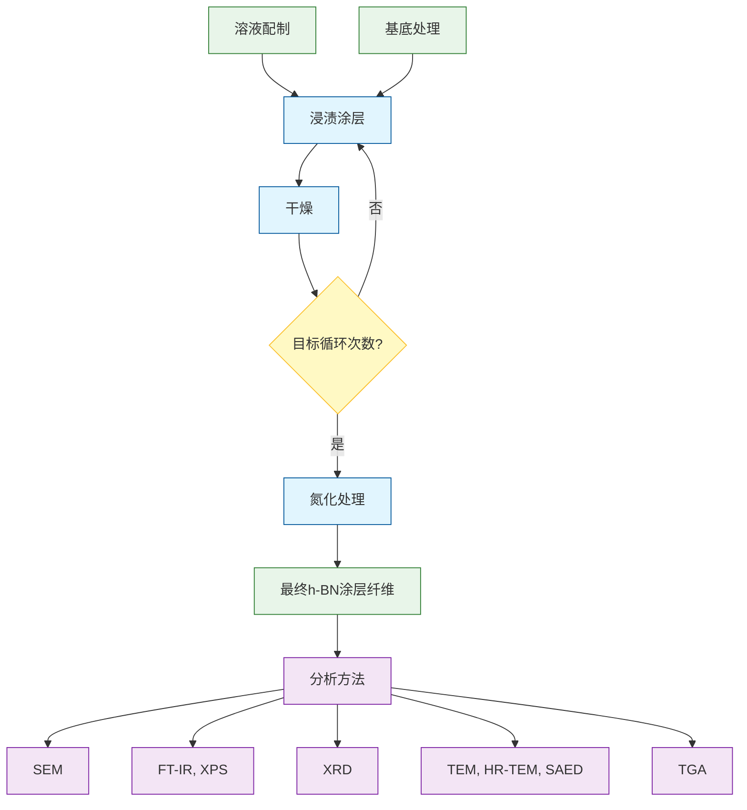

```mermaid
graph TD
    A1[溶液配制] --> B[浸渍涂层]
    A2[基底处理] --> B
    B --> C[干燥]
    C --> D{目标循环次数?}
    D -- 否 --> B
    D -- 是 --> E[氮化处理]
    E --> F[最终h-BN涂层纤维]
    F --> G[分析方法]
    G --> G1[SEM]
    G --> G2[FT-IR, XPS]
    G --> G3[XRD]
    G --> G4[TEM, HR-TEM, SAED]
    G --> G5[TGA]
    
    class A1,A2,F material
    class B,C,E process
    class D decision
    class G,G1,G2,G3,G4,G5 analysis
    
    classDef material fill:#e8f5e9,stroke:#2e7d32
    classDef process fill:#e1f5fe,stroke:#01579b
    classDef decision fill:#fff9c4,stroke:#fbc02d
    classDef analysis fill:#f3e5f5,stroke:#7b1fa2
```
